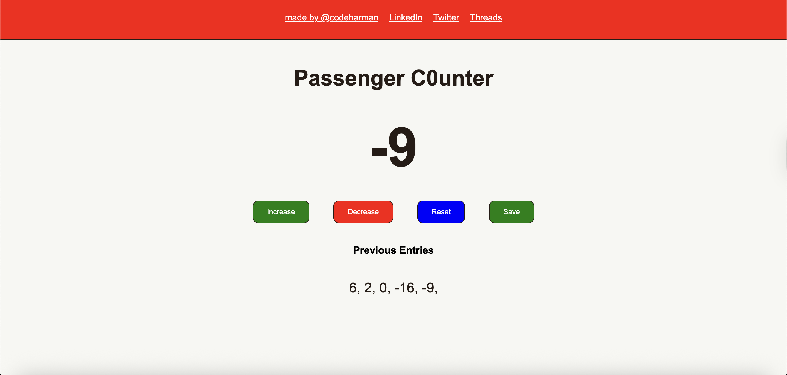
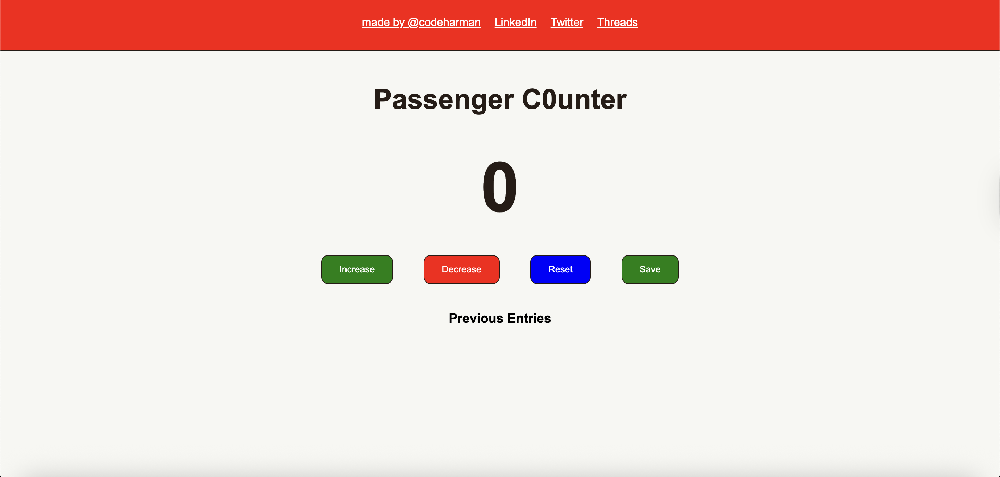
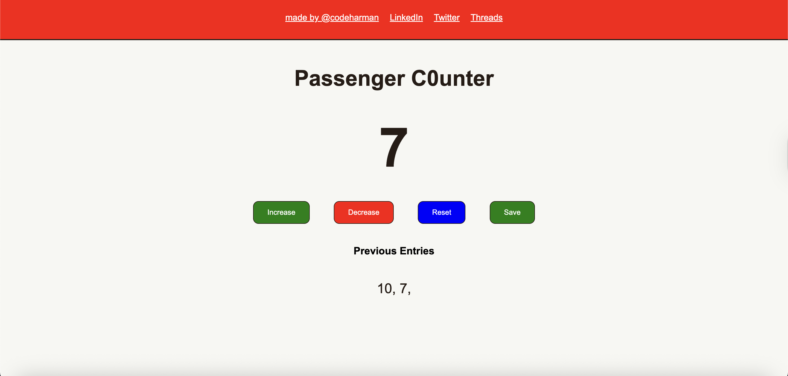

# 🚍 Passenger Counter App

A beginner-friendly project to **count passengers** with **add, subtract, reset, and save** functions.  
Built using **HTML, CSS, and JavaScript**, this app is great for practicing **DOM manipulation** and button event handling.  

---

## ✨ Features
- ➕ **Increase**: Add 1 to the counter.  
- ➖ **Decrease**: Subtract 1 from the counter (can go below 0 right now).  
- 🔄 **Reset**: Reset the counter back to 0.  
- 💾 **Save**: Save the current count to a list of previous entries.  
- 🖼️ **Responsive UI**: Styled with CSS and includes a navigation bar with social links.  

---

## 🛠️ Tech Stack

- HTML5 – Structure
- CSS3 – Styling
- Vanilla JavaScript – Logic

## 🚀 Getting Started

Clone this repository:

- git clone https://github.com/your-username/passenger-counter.git

- Open the project folder.
- Open index.html in your browser.

## 📸 Demo Screenshot





## What I Learned

- Using document.getElementById to grab elements from the DOM.
- Updating elements with .textContent.
- Attaching functions to buttons via onclick attributes.
- Saving data in the DOM dynamically.

## 📬 Let's Connect
[](https://codeharman.vercel.app/)
[](https://www.linkedin.com/in/codeharman/)
[-000000?style=flat&logo=x&logoColor=white)](https://x.com/codeharmann)
[](mailto:iamsingh.hj@email.com)


## 📂 Project Structure
```bash
passenger-counter/
│
├── index.html      # Main HTML file
├── styles.css      # Stylesheet
├── index.js        # JavaScript logic
└── README.md       # Project documentation